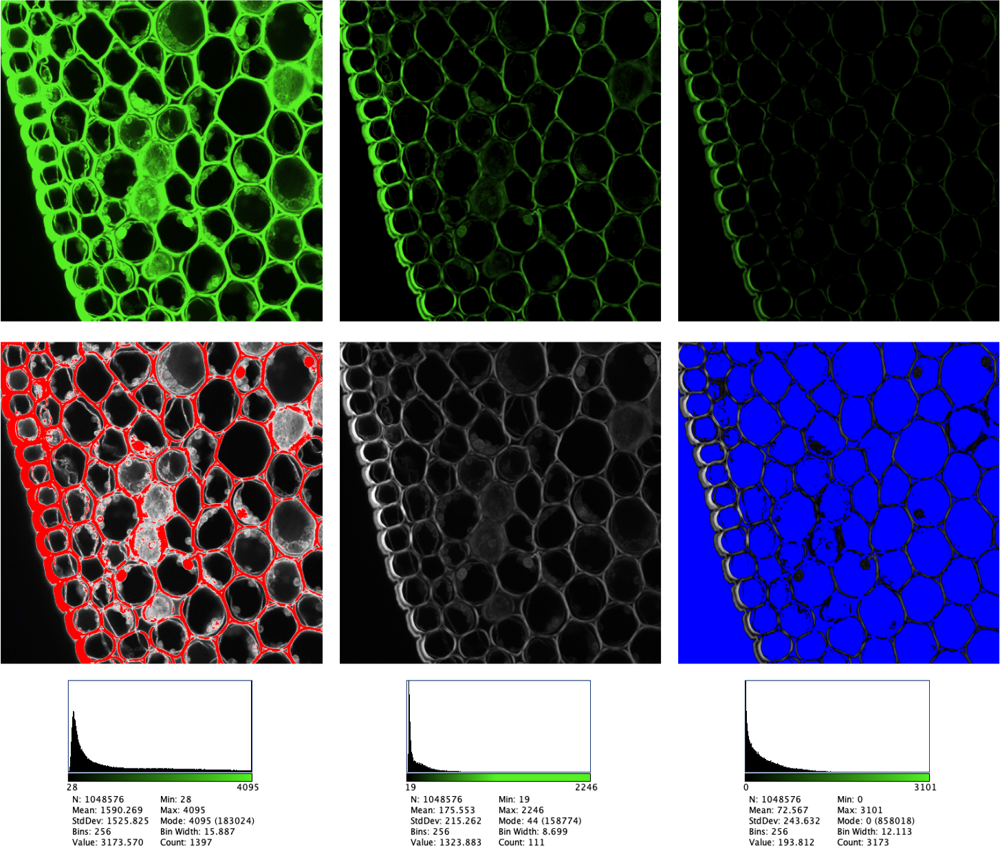
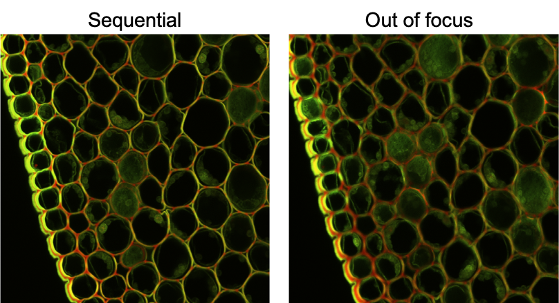

# :microscope: LCI Image Analysis Workshop 2023

Welcome to the image analysis workshop organized by the Bioimage Informatics facility & the Live Cell Imaging facility! During this workshop you will:

- [x] See typical examples of what can be done with image analysis and the limitations of each example
- [x] Understand which image artifacts can be corrected by image analysis in some cases but are easier to correct before acquisition, e.g., uneven illumination, noise
- [x] Understand which image artifacts cannot be corrected by image analysis, e.g., saturation, under exposure, bleedthrough

In order to follow-up the examples presented in this workshop, download the code available in this GitHub page (you can do that by clicking on the green buttom above). In addition, you also have to download Fiji from the following [link](https://fiji.sc/). The installation of additional required plugins will be detailed in the next sessions.

:bookmark: **Tip**: To open an image in Fiji, go to "File->Open". Then browse the image of interest. If the Bio-Formats plugin interface appears, check the import options and press "OK"

:bookmark: **Tip**: You can open a script in Fiji by dragging and droping a file in the main interface or through "Plugins->Macros->Edit...". Then browse the code to be used in each session.

:people_holding_hands: **Group work**: For each activity you will be radomly assigned to breakout rooms to work in groups. Results should be reported in the following shared document.

## :alarm_clock: Schedule

* **10:10-11:10** Correction of uneven illumination
* **11:15-12:10** Handling noise
* **12:10-13.10** Lunch break
* **13:10-14:10** Image artifacts that cannot be fixed
* **14:15-15:10** Show-case image analysis tasks using the students images

## :muscle: Let's start!

## 1) Uneven illumination - how to correct

Uneven illumation can be due to different factors, e.g., microscope settings; sample artifacts (samples that are not flat); shading or vignetting (attenuation of the pixel intensity from the centre of the optical axis to the edges). 

Uneven illumination can cause discontinuities in whole slide images, background bleaching in time-lapse fluorescent images and compromise downstream analysis. In this workshop we will explore two algorithms that can be used to correct such artifacts.
* [Rolling-ball](https://imagejdocu.list.lu/gui/process/subtract_background) algorithm
* [BaSiC](https://github.com/marrlab/BaSiC#imagejfiji-plugin) plugin (click on the link to follow installation instructions)

:arrow_right: Images to be used in this session are located in "../images/illumination_correction/"

Wait to be assigned to one of the breakout rooms and then follow the instructions corresponding to your group:

**Group 1:** Illumination correction via rolling ball algorithm
* Open the image of interest
* Go to "Process->Subtract Background..."
* Choose the radius of the rolling ball algorithm and press OK

Repeat these steps for tthe files in the **stitched** folder. You can also try to correct individual tiles ("tiles" folder). Try different values of the radius parameter.

:bulb: What happens as the size of radius increases?

:bulb: What happens as the overlap increases?

**Groups 2 and 3:** Illumination correction via BaSiC plugin
* Install the BaSiC plugin via Fiji update sites (instructions above)
* Open the script "Illumination_Basic.ijm"
* Updage parameter values (lines 12 to 15)
	- For "img2_", set parameters to:
	```
	overlap = 1; // choose 1, 5 or 10
	grid_size_x = 5;
	grid_size_y = 3;
	file_name = "img";
	```
	- For "WSI_Brain", set parameters to:
	```
	overlap = 10;
	grid_size_x = 9;
	grid_size_y = 6;
	file_name = "C3-BrainSection";
	```
* Press the "Run buttom". A Dialog window will appear and you should browse the folder named "uncorrected" inside the reference folder ("../images/illumination_correction/tiles/...").
	- **Group 2:** run the script for "img2" with different overlap values ("img2_1pc", "img2_5pc" and "img2_10pc")
	- **Group 3:** run the script for "img2_10pc" and "WSI_Brain"

**Note:** Corrected stitched images are saved inside the reference folder

:bulb: Comapre the uncorrected *vs* corrected images and discuss how the corrected image was improved (*or not*) for each example.

:bulb: What happens as the overlapping increases? (Group 2)

:bulb: What happens as the number of tiles increases? (Group 3)

**Group 4:** Uneven focus on z-stacks
* Open the image of interest in Fiji (from folder "../images/illumination_correction/uneven_focus/");
* Inspect the z-stack. What is wrong?
* Create a copy of the reference stack ("Image->Duplicate")
* Segment via thresholding ("Image->Adjust->Threshold"). Keep resulting segmented stack.
* Select the original stack and apply a maximum intensity projection (MIP), via "Image->Stacks->Z project..."
* Create two copies of the projected image. 
	- Apply the rolling ball algorithm ("Process->Subtract Background...") in one of them
* Segment both copies via thresholding

:bulb: Compare the segmentation results of 1) the z-stack, 2) the MIP, and 3) the corrected MIP.

**Note:** To help your analysis, you can compare the intensity profiles of the reference images: Draw a straight line from left to right in the reference image, then go to "Analyze->Plot Profile"

## 2) Handling noise

Noise....


Each group should take a specific reference image and generate the output measures using the script "Noise.ijm" script.

-> Images to be used in this session are located in "../images/noise/"

-> Instructions to run the script and generate the measures: 
* Open the image of interest in Fiji;
* Open and run the script "Noise.ijm";
* Copy the measures from the "Summary" table to the shared file 
* Inspect the Results table and the Roi Manager tool
* Take some time to analyze the script!

**Testing the Median filter**: uncomment line #20 of the script (by removing the "//" at beggining of the line, see below). Then re-run the script for the same reference image. Copy the measures to the shared file and compare the new measures with the previous values.

```
run("Median...", "radius=4");
```

:bulb: What happens as the size of the averaging filter increases?

:bulb: What happens if we don't use the median filter?


## 3) Image artifacts

Some image artifacts cannot be fixed by image analysis and may compromise intensity and shape measurements. Examples can be seen in the images below, such as, bleedtrough, saturation, under exposure and soft focus.

### Bleedtrough


### Saturation & Under exposure

</a>

### Soft focus

</a>

### Hands-on exercise

You will work in groups to investigate how each artifact can affect image quantification.

-> Images to be used in this session are located in "../images/image_artifacts/"

-> Instructions to run the script: 
* Open the image of interest in Fiji;
* Open and run the script "ImageArtifacts.ijm";
* From the "Log" window copy the values of the "total segmented area" and "average intensity" of each channel (green and red)
* Take some time to analyze the script!

Wait for all the groups to complete the task and summarize results in the shared file. Then discuss:

:bulb: How are the measures affected by each artifact?

:bulb: How to avoid such artifacts during acquisition?

## 4) Nuclei & Cell Segmentation

The segmentation of nuclei and cells are the starting point of several image analysis tasks in microscopy.

